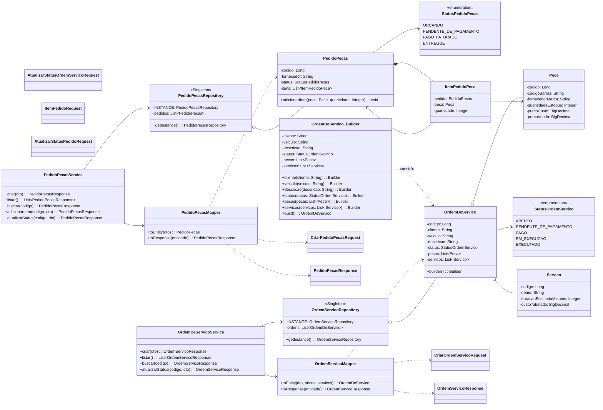
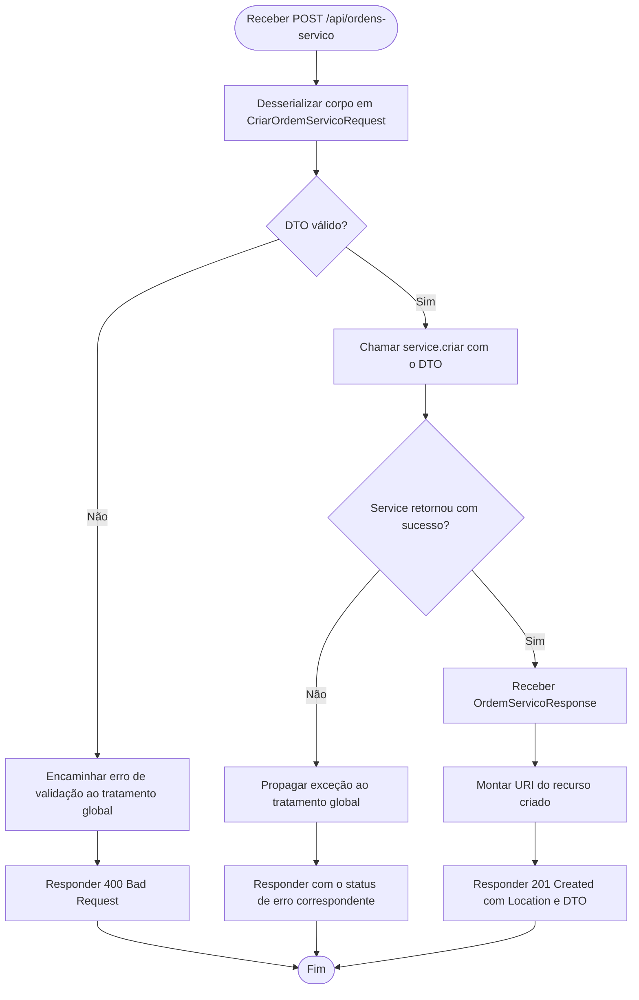

# Diagramas da OAT 2

## Diagrama de Classes

```mermaid
classDiagram
    direction LR

    class StatusOrdemServico {
        <<enumeration>>
        ABERTO
        PENDENTE_DE_PAGAMENTO
        PAGO
        EM_EXECUCAO
        EXECUTADO
    }

    class StatusPedidoPecas {
        <<enumeration>>
        ORCANDO
        PENDENTE_DE_PAGAMENTO
        PAGO_FATURADO
        ENTREGUE
    }

    class Peca {
        -codigo: Long
        -codigoBarras: String
        -fornecedorMarca: String
        -quantidadeEstoque: Integer
        -precoCusto: BigDecimal
        -precoVenda: BigDecimal
    }

    class Servico {
        -codigo: Long
        -nome: String
        -duracaoEstimadaMinutos: Integer
        -custoTabelado: BigDecimal
    }

    class OrdemDeServico {
        -codigo: Long
        -cliente: String
        -veiculo: String
        -descricao: String
        -status: StatusOrdemServico
        -pecas: List~Peca~
        -servicos: List~Servico~
        +builder(): Builder
    }

    class OrdemDeServico_Builder {
        -cliente: String
        -veiculo: String
        -descricao: String
        -status: StatusOrdemServico
        -pecas: List~Peca~
        -servicos: List~Servico~
        +cliente(cliente: String): Builder
        +veiculo(veiculo: String): Builder
        +descricao(descricao: String): Builder
        +status(status: StatusOrdemServico): Builder
        +pecas(pecas: List~Peca~): Builder
        +servicos(servicos: List~Servico~): Builder
        +build(): OrdemDeServico
    }

    class PedidoPecas {
        -codigo: Long
        -fornecedor: String
        -status: StatusPedidoPecas
        -itens: List~ItemPedidoPeca~
        +adicionarItem(peca: Peca, quantidade: Integer): void
    }

    class ItemPedidoPeca {
        -pedido: PedidoPecas
        -peca: Peca
        -quantidade: Integer
    }

    class CriarOrdemServicoRequest
    class AtualizarStatusOrdemServicoRequest
    class OrdemServicoResponse
    class CriarPedidoPecasRequest
    class ItemPedidoRequest
    class AtualizarStatusPedidoRequest
    class PedidoPecasResponse

    class OrdemServicoMapper {
        +toEntity(dto, pecas, servicos): OrdemDeServico
        +toResponse(entidade): OrdemServicoResponse
    }

    class PedidoPecasMapper {
        +toEntity(dto): PedidoPecas
        +toResponse(entidade): PedidoPecasResponse
    }

    class OrdemDeServicoService {
        +criar(dto): OrdemServicoResponse
        +listar(): List~OrdemServicoResponse~
        +buscar(codigo): OrdemServicoResponse
        +atualizarStatus(codigo, dto): OrdemServicoResponse
    }

    class PedidoPecasService {
        +criar(dto): PedidoPecasResponse
        +listar(): List~PedidoPecasResponse~
        +buscar(codigo): PedidoPecasResponse
        +adicionarItem(codigo, dto): PedidoPecasResponse
        +atualizarStatus(codigo, dto): PedidoPecasResponse
    }

    class OrdemServicoRepository {
        <<Singleton>>
        -INSTANCE: OrdemServicoRepository
        -ordens: List~OrdemDeServico~
        +getInstance(): OrdemServicoRepository
    }

    class PedidoPecasRepository {
        <<Singleton>>
        -INSTANCE: PedidoPecasRepository
        -pedidos: List~PedidoPecas~
        +getInstance(): PedidoPecasRepository
    }

    OrdemDeServico --> StatusOrdemServico
    OrdemDeServico o-- Peca
    OrdemDeServico o-- Servico
    OrdemDeServico_Builder ..> OrdemDeServico : constrói
    PedidoPecas --> StatusPedidoPecas
    PedidoPecas *-- ItemPedidoPeca
    ItemPedidoPeca --> PedidoPecas
    ItemPedidoPeca --> Peca
    OrdemServicoMapper ..> CriarOrdemServicoRequest
    OrdemServicoMapper ..> OrdemDeServico
    OrdemServicoMapper ..> OrdemServicoResponse
    PedidoPecasMapper ..> CriarPedidoPecasRequest
    PedidoPecasMapper ..> PedidoPecas
    PedidoPecasMapper ..> PedidoPecasResponse
    OrdemDeServicoService --> OrdemServicoRepository
    OrdemDeServicoService --> OrdemServicoMapper
    PedidoPecasService --> PedidoPecasRepository
    PedidoPecasService --> PedidoPecasMapper
    OrdemServicoRepository o-- OrdemDeServico
    PedidoPecasRepository o-- PedidoPecas
```

## Diagrama de Atividade - POST /api/ordens-servico

```mermaid
flowchart TD
    A([Receber POST /api/ordens-servico]) --> B[Desserializar corpo em CriarOrdemServicoRequest]
    B --> C{DTO válido?}
    C -- Não --> D[Encaminhar erro de validação ao tratamento global]
    D --> E[Responder 400 Bad Request]
    C -- Sim --> F[Chamar service.criar com o DTO]
    F --> G{Service retornou com sucesso?}
    G -- Não --> H[Propagar exceção ao tratamento global]
    H --> I[Responder com o status de erro correspondente]
    G -- Sim --> J[Receber OrdemServicoResponse]
    J --> K[Montar URI do recurso criado]
    K --> L[Responder 201 Created com Location e DTO]
    E --> M([Fim])
    I --> M
    L --> M
```
