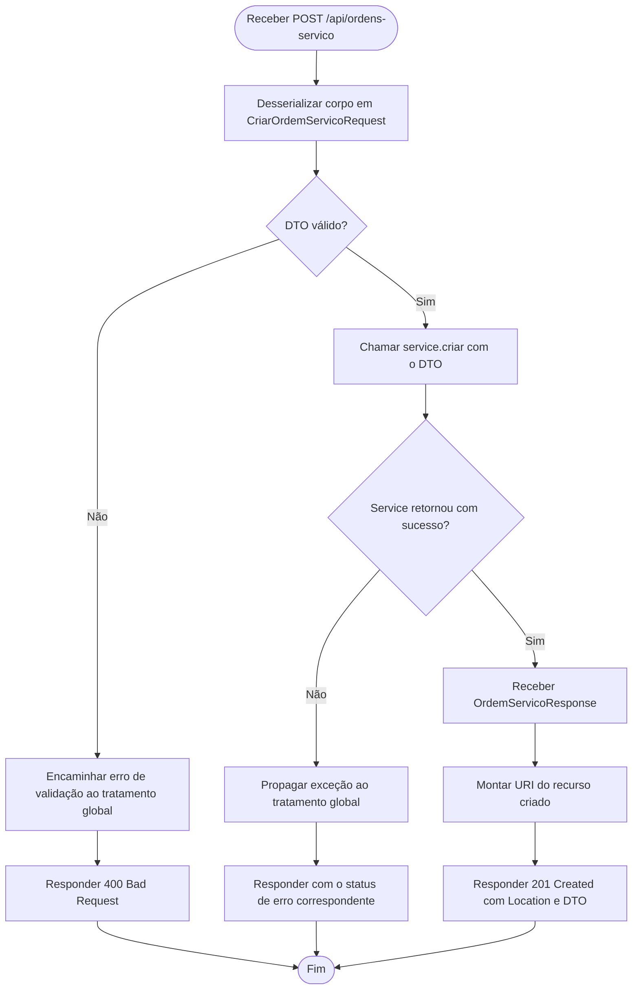

# Diagrama de Atividade — POST /api/ordens-servico

O diagrama apresenta exclusivamente a visão lógica do `OrdemServicoController`. As
operações internas do Service, Mapper e Repository ficam fora do escopo.

