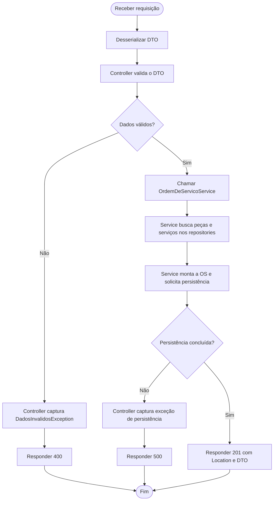

# Diagrama de Atividade — POST /api/ordens-servico

```mermaid
flowchart TD
    A([Receber requisição]) --> B[Desserializar DTO]
    B --> C[Controller valida o DTO]
    C --> D{Dados válidos?}
    D -- Não --> E[Controller captura DadosInvalidosException]
    E --> F[Responder 400]
    D -- Sim --> G[Chamar OrdemDeServicoService]
    G --> H[Service busca peças e serviços nos repositories]
    H --> I[Service monta a OS e solicita persistência]
    I --> J{Persistência concluída?}
    J -- Não --> K[Controller captura exceção de persistência]
    K --> L[Responder 500]
    J -- Sim --> M[Responder 201 com Location e DTO]
    F --> N([Fim])
    L --> N
    M --> N
```
