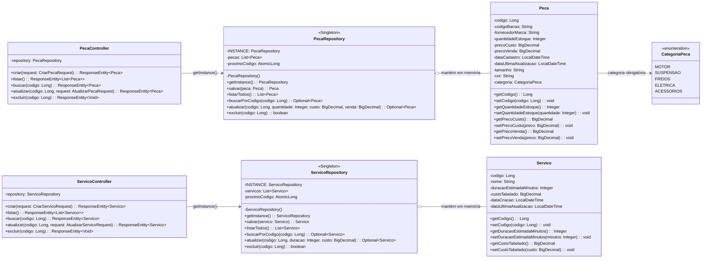
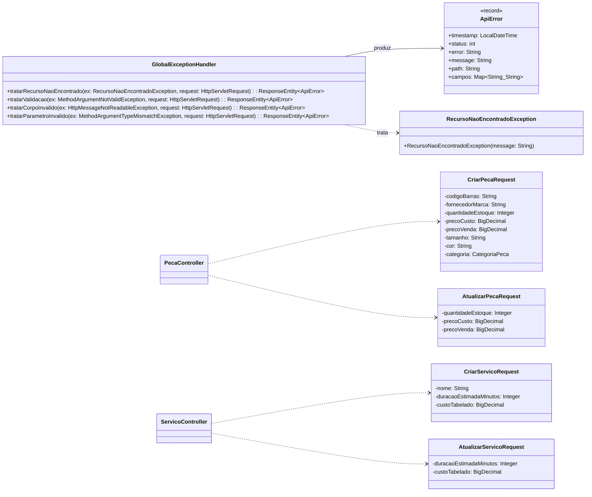
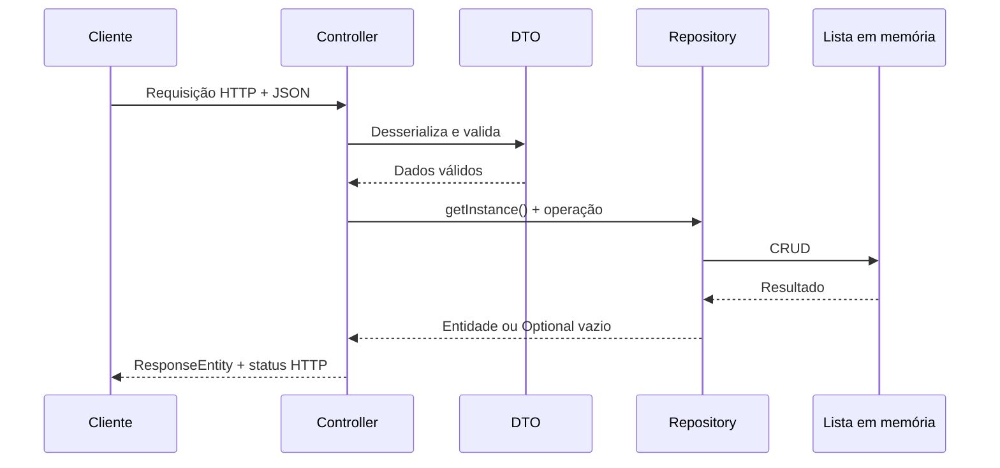

# Diagrama de Classes - API MecâniQA

## Núcleo da aplicação

Os repositories possuem construtor privado, instância estática única e método público
`getInstance()`. Não existe injeção de dependência entre controllers e repositories.

## DTOs e tratamento de erros

## Fluxo principal

