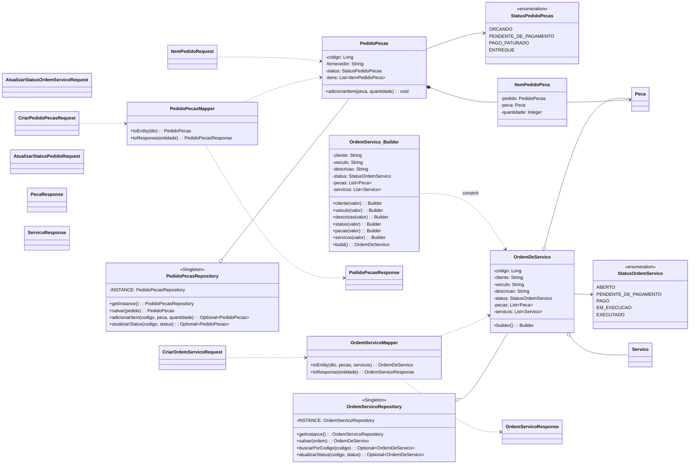

# Diagrama de Classes - API MecâniQA OAT 2

O diagrama representa as entidades, a entidade associativa, os DTOs, os mappers,
o Builder de Ordem de Serviço e os repositories Singleton em memória.

```mermaid
classDiagram
    direction LR

    class StatusOrdemServico {
        <<enumeration>>
        ABERTO
        PENDENTE_DE_PAGAMENTO
        PAGO
        EM_EXECUCAO
        EXECUTADO
    }
    class StatusPedidoPecas {
        <<enumeration>>
        ORCANDO
        PENDENTE_DE_PAGAMENTO
        PAGO_FATURADO
        ENTREGUE
    }
    class Peca
    class Servico
    class OrdemDeServico {
        -codigo: Long
        -cliente: String
        -veiculo: String
        -descricao: String
        -status: StatusOrdemServico
        -pecas: List~Peca~
        -servicos: List~Servico~
        +builder(): Builder
    }
    class OrdemServico_Builder {
        -cliente: String
        -veiculo: String
        -descricao: String
        -status: StatusOrdemServico
        -pecas: List~Peca~
        -servicos: List~Servico~
        +cliente(valor): Builder
        +veiculo(valor): Builder
        +descricao(valor): Builder
        +status(valor): Builder
        +pecas(valor): Builder
        +servicos(valor): Builder
        +build(): OrdemDeServico
    }
    class PedidoPecas {
        -codigo: Long
        -fornecedor: String
        -status: StatusPedidoPecas
        -itens: List~ItemPedidoPeca~
        +adicionarItem(peca, quantidade): void
    }
    class ItemPedidoPeca {
        -pedido: PedidoPecas
        -peca: Peca
        -quantidade: Integer
    }

    OrdemDeServico --> StatusOrdemServico
    OrdemDeServico o-- Peca
    OrdemDeServico o-- Servico
    OrdemServico_Builder ..> OrdemDeServico : constrói
    PedidoPecas --> StatusPedidoPecas
    PedidoPecas *-- ItemPedidoPeca
    ItemPedidoPeca --> Peca

    class CriarOrdemServicoRequest
    class AtualizarStatusOrdemServicoRequest
    class OrdemServicoResponse
    class CriarPedidoPecasRequest
    class ItemPedidoRequest
    class AtualizarStatusPedidoRequest
    class PedidoPecasResponse
    class PecaResponse
    class ServicoResponse
    class OrdemServicoMapper {
        +toEntity(dto, pecas, servicos): OrdemDeServico
        +toResponse(entidade): OrdemServicoResponse
    }
    class PedidoPecasMapper {
        +toEntity(dto): PedidoPecas
        +toResponse(entidade): PedidoPecasResponse
    }

    CriarOrdemServicoRequest ..> OrdemServicoMapper
    OrdemServicoMapper ..> OrdemDeServico
    OrdemServicoMapper ..> OrdemServicoResponse
    CriarPedidoPecasRequest ..> PedidoPecasMapper
    ItemPedidoRequest ..> PedidoPecas
    PedidoPecasMapper ..> PedidoPecas
    PedidoPecasMapper ..> PedidoPecasResponse

    class OrdemServicoRepository {
        <<Singleton>>
        -INSTANCE: OrdemServicoRepository
        +getInstance(): OrdemServicoRepository
        +salvar(ordem): OrdemDeServico
        +buscarPorCodigo(codigo): Optional~OrdemDeServico~
        +atualizarStatus(codigo, status): Optional~OrdemDeServico~
    }
    class PedidoPecasRepository {
        <<Singleton>>
        -INSTANCE: PedidoPecasRepository
        +getInstance(): PedidoPecasRepository
        +salvar(pedido): PedidoPecas
        +adicionarItem(codigo, peca, quantidade): Optional~PedidoPecas~
        +atualizarStatus(codigo, status): Optional~PedidoPecas~
    }

    OrdemServicoRepository o-- OrdemDeServico
    PedidoPecasRepository o-- PedidoPecas
```

Os controllers nunca recebem ou devolvem entidades de domínio: a fronteira HTTP usa
exclusivamente DTOs. Os mappers concentram a conversão entre os dois contextos.
